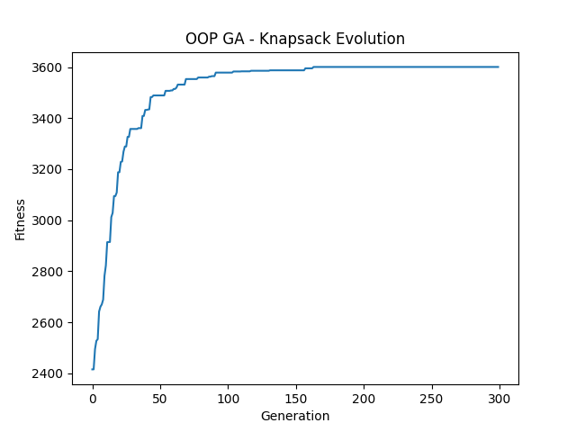
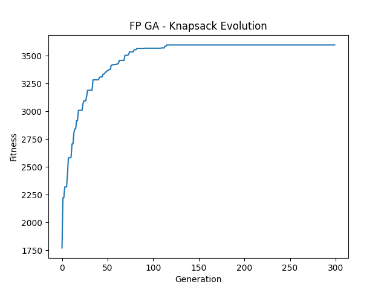

# **[Extended Assignment]** Genetic Algorithm (GA) — Object-Oriented vs Functional Programming

**Instructor:** Nguyen Thanh Cong, PhD

**Student Name:** Lai Tran Tri

**Student ID:** 2413631

## 1. Project Overview

This project is an extended major assignment exploring the implementation of a Genetic Algorithm (GA) through two distinct software engineering paradigms: **Object-Oriented Programming (OOP)** and **Functional Programming (FP)**.

The primary objective is to evaluate the trade-offs between mutability and immutability, statefulness and pure functions, and execution speed versus code safety. To demonstrate the robustness and extensibility of the architecture, the GA is applied to three distinct optimization problems, ranging from classical computer science puzzles to practical machine learning applications.

## 2. Implemented Optimization Problems

1. **OneMax Problem:** The baseline test. A pure discrete optimization task aiming to maximize the number of `1`s in a binary chromosome of length `L=100`.
2. **0/1 Knapsack Problem:** A constrained combinatorial optimization problem. The GA must maximize the total value of items without exceeding a strict weight capacity (`n=100`).
3. **Hyperparameter Tuning (Bonus - Extensible Design):** Applying GA to the Machine Learning domain. The algorithm decodes a 16-bit chromosome into continuous floating-point values to optimize the Learning Rate (`alpha` in [0.0001, 0.1]) and L2 Regularization (`lambda` in [0.0, 1.0]) for a predictive model, minimizing the simulated validation loss.

## 3. Installation & Execution

### Prerequisites

- Python 3.8+
- `matplotlib` (for generating evolution curves)

```bash
pip install matplotlib
```

### Running the Experiments

Both paradigms are centrally controlled by `config.py` to ensure identical hyperparameter constraints (Population: 100, Generations: 300, Mutation Rate: 1/L).

To execute the Object-Oriented pipeline:

```bash
python oop/run.py
```

To execute the Functional Programming pipeline:

```bash
python fp/run.py
```

_Note: Execution will automatically generate fitness evolution plots (`.png`) and detailed performance logs (`.json`) in the `reports/` directory._

### Running Unit Tests

The project features strict test coverage for selection, crossover, mutation, and generational improvement.

```bash
python -m unittest oop/tests/test_ga.py
python -m unittest fp/tests/test_ga.py
```

## 4. Reflection: OOP vs. FP Trade-offs

Transitioning the GA engine between OOP and FP paradigms revealed significant architectural and computational trade-offs:

- **Object-Oriented Programming (OOP):** The OOP implementation utilizes the Strategy Pattern to decouple genetic operators (Selection, Crossover, Mutation) from the core engine. Modeling biological processes natively aligns with OOP; a `Chromosome` object "mutates" by altering its internal state in place. Because Python lists are mutable, in-place bit-flipping is highly memory-efficient. This resulted in superior raw execution speed, solving the Knapsack problem in approximately `~0.26s` and the complex Tuning problem in `~0.12s`.
- **Functional Programming (FP):** The FP pipeline completely discards classes and mutable states, relying strictly on pure functions (`map`, `reduce`, `filter`) and immutable `tuples`. While this eliminates side-effects and race conditions—making the codebase theoretically perfect for parallel or distributed computing—it introduces a heavy performance penalty. Python's garbage collection struggles with continuous memory allocation for new tuples in every generation, causing the FP execution time to be roughly 2x to 3x slower than OOP (e.g., `~0.53s` for Knapsack).

<figure style="text-align: center;">
  
  
  <figcaption style="font-weight: bold; font-size: 18px;">
    An example of obtained results
  </figcaption>
</figure>

Ultimately, OOP proved superior for the raw iterative speed required by heuristic searches, while FP enforced a safer, side-effect-free data transformation pipeline.

## 5. Extra Analysis: GA as an Automatic Hyperparameter Tuning Strategy

In the realm of machine learning and deep learning, model optimization fundamentally occurs on two distinct levels: **updating the trainable parameters** (typically via gradient-based methods) and **configuring the overarching hyperparameters**. Hyperparameters — such as **learning rates, regularization coefficients, or architectural dimensions** — are not learned from the data directly; rather, they govern the learning process itself.

**The Optimization Bottleneck:**
The selection of these hyperparameters profoundly **impacts an algorithm's behavior, training duration, and, most critically, its ability to generalize to unseen data**. A poorly tuned model, even with a robust architecture, can fail catastrophically. Consequently, **hyperparameter tuning** is not merely a preliminary setup step; it is a complex optimization problem in its own right, where the objective function is to minimize the validation error. However, this hyperparameter search landscape is notoriously difficult to navigate — it is often non-differentiable, highly non-convex, and computationally expensive to evaluate.

**Why Genetic Algorithms are powerful alternatives:**
While traditional strategies like **Grid Search, Random Search, and Bayesian Regression Model** are standard approaches to navigating this space, they can struggle with the curse of dimensionality, blind sampling, or sequential bottlenecks. By successfully applying a Genetic Algorithm to this domain, this project demonstrates why GA is a highly viable and effective method alongside these traditional techniques:

1. **Derivative-Free Flexibility:** GA does not require a differentiable loss landscape. Through binary decoding, it natively handles both discrete variables (like network layers/dimensions) and continuous ranges (like learning rates, regularization coefficients) seamlessly within the same architecture.
2. **Directed, Population-Based Exploration:** Unlike pure random sampling, GA is a heuristic search that "learns" from past evaluations. By utilizing _Selection_ and _Crossover_, the algorithm preserves and combines "building blocks" of high-performing hyperparameter configurations. Furthermore, maintaining a parallel _Population_ allows GA to explore multiple regions of the search space simultaneously.
3. **Escaping Local Optima:** The stochastic nature of _Mutation_ prevents the search from getting trapped in suboptimal valleys, a common pitfall in complex, non-convex hyperparameter landscapes.

Ultimately, casting **hyperparameter tuning** as an evolutionary process provides **a robust, parallelizable, and global search mechanism** that abstracts away the mathematical rigidity of the loss landscape, making it **a formidable tool in the ML/DL optimization toolkit**.
